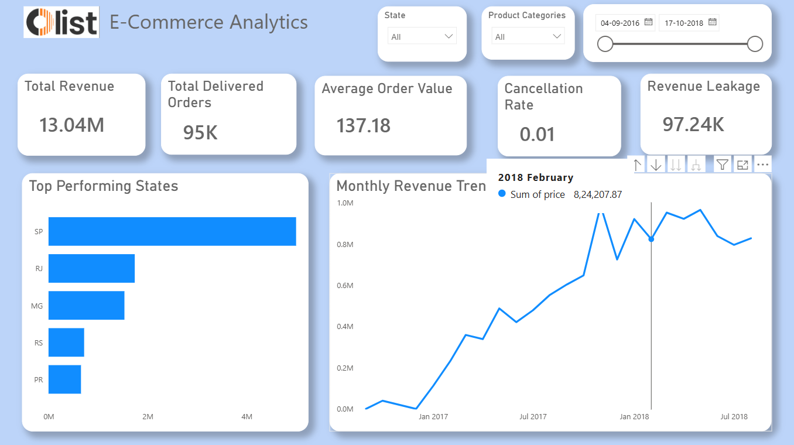
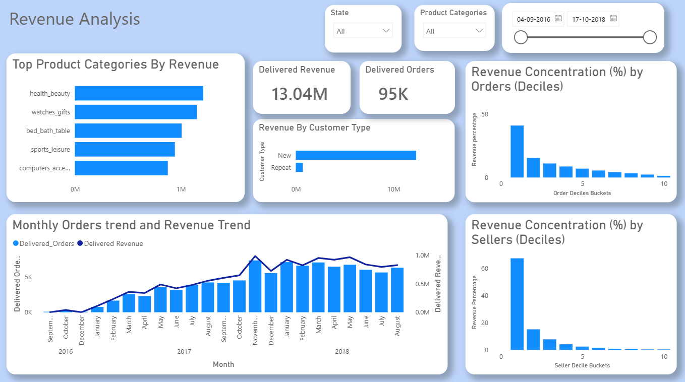

# Olist-Analytics

# E-commerce Revenue & Funnel Analysis

## Project Overview

This project analyzes an end-to-end **e-commerce order lifecycle** with a focus on **revenue performance, growth trends, customer behavior, seller concentration, funnel efficiency, and revenue leakage due to cancellations**.

Using **SQL-based analysis** and an **interactive dashboard**, the project translates raw transactional data into **business-level insights** that can drive operational, product, and revenue decisions.

---

##  Business Objectives

* Measure overall revenue and growth trends
* Understand order and revenue concentration risks
* Analyze customer mix (new vs repeat)
* Identify revenue leakage points in the order funnel
* Diagnose cancellation patterns and high-risk segments
* Highlight seller and category-level dependencies
* Segment customers via RFM analysis to identify high-value, at-risk, and growth-potential customers
---

##  Key Metrics Tracked

* **Total Delivered Revenue:** 13.04M
* **Delivered Orders:** 95K
* **Average Order Value (AOV):** 137.18
* **Cancellation Rate:** ~1%
* **Revenue Leakage (Canceled / Unavailable Orders):** 97.24K

---

##  Revenue & Growth Insights

* Revenue shows **strong month-over-month growth** through 2017, stabilizing at a higher baseline in 2018
* Growth is primarily **order-volume driven**, with relatively stable AOV
* Indicates successful scaling but limited monetization expansion

**Insight:** Future growth should focus on **AOV expansion** via bundling, cross-sell, or premium offerings

---

##  Geographic Performance

* Revenue is **heavily concentrated in São Paulo (SP)**
* RJ and MG follow at a much lower contribution level

**Risk:** Over-dependence on a single state increases exposure to logistics, regulatory, or demand shocks

---

##  Product Category Analysis

Top revenue-driving categories include:

* Health & Beauty
* Watches & Gifts
* Bed, Bath & Table
* Sports & Leisure
* Computers & Accessories

Several of these categories also contribute significantly to **revenue leakage**, indicating operational or fulfillment challenges

---

##  Customer Behavior Analysis

* Revenue is **dominated by new customers**
* Repeat customers contribute a **very small share of total revenue**

**Key Insight:** The business relies heavily on customer acquisition, signaling **weak retention and lifetime value risk**

---
## Key Insights from RFM Analysis:
* The “Others” segment represents 28% of customers and is a high-potential growth segment that can be upsold or converted into Loyal/Champions with targeted campaigns
* Top 54% of revenue comes from Loyal and Others segments, highlighting the importance of middle and repeat customer segments
* 31% of customers are at risk of churn (At Risk + Lost), providing an opportunity for retention-focused campaigns
* Champions are few but high-value, warranting VIP engagement strategies
* RFM insights complement funnel and revenue analysis to prioritize marketing, retention, and upselling strategie
  
##  Revenue Concentration Risk

### Orders

* Top 10% of orders contribute **~41% of total revenue**

### Sellers

* Top 10% of sellers contribute **~67% of total revenue**

**Risk:** Platform performance is highly dependent on a small seller base, increasing operational and revenue risk

---

##  Funnel & Conversion Analysis

### Order Funnel

* Purchase → Approval: ~100% conversion
* Approval → Shipping: **largest drop-off**
* Shipping → Delivery: second largest drop-off

### Revenue Leakage by Stage

* **Approval → Shipping:** ~2.12L (highest loss)
* **Shipping → Delivery:** ~1.56L
* **Purchase → Approval:** negligible

**Root Cause:** Leakage is driven by **logistics and seller fulfillment**, not payment or demand issues

---

##  Cancellation Insights

* High-value orders show a **higher cancellation rate** than low-value orders
* Cancellations, while low in volume, result in **disproportionate revenue loss**

**Likely Causes:**

* Stock unavailability
* Seller delays
* Logistics capacity mismatch

---

##  Business Recommendations

1. Fix approval-to-shipping delays with seller SLAs
2. Prioritize high-value order protection
3. Diversify seller revenue contribution
4. Improve repeat customer retention strategies
5. Introduce seller-level performance incentives

---

##  Tools & Skills Demonstrated

* Advanced SQL (CTEs, window functions, NTILE, funnel analysis)
* Python for cleaning
* Power BI for dashboarding
* Revenue and growth analytics
* Funnel and conversion diagnostics
* Risk and concentration analysis
* Business storytelling via dashboards

---
## Dashboard Overview

## Revenue Analysis

## Funnel & Revenue Leakage

## Cancellations & Leakage

## Conclusion

This project demonstrates how raw transactional data can be converted into **actionable business insights**, highlighting both growth opportunities and operational risks in an e-commerce marketplace.

## Project Workflow

This project follows a clear end-to-end data analytics workflow, mirroring real-world analytics practices:

###  Data Cleaning & Preparation (Python)

* Performed initial data cleaning and preprocessing using **Python (Pandas, NumPy)**
* Handled missing values, corrected data types, and standardized date/time columns
* Validated data quality before loading into the analytics layer

###  Data Analysis (SQL)

* Used **SQL** for in-depth analysis and metric creation
* Applied advanced SQL concepts such as:

  * CTEs
  * Window functions
  * Aggregations and joins
  * Decile-based analysis
* Derived business metrics including revenue, AOV, funnel drop-offs, and cancellation impact

###  Data Visualization & Storytelling (Power BI)

* Built an interactive **Power BI dashboard** to present insights
* Designed pages for:

  * Executive overview
  * Revenue and customer analysis
  * Funnel performance and revenue leakage
  * Cancellations and risk analysis
* Added filters and drill-downs to enable exploratory analysis

This structured flow ensures clean data, reliable analysis, and business-focused storytelling.
